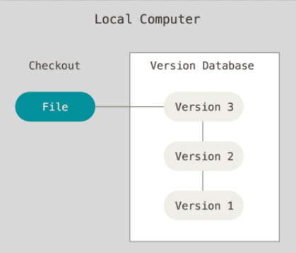

# 1.VCS란 무엇인가

VCS는 "Version Control System"의 약자로, 소프트웨어 개발에서 코드의 버전을 관리하고 추적하는 시스템을 의미한다.
* VCS의 목적
    * 버전 관리 : 소프트웨어 개발 프로젝트에서 코드의 변경 사항을 추적하고 버전을 관리한다. 이를 통해 이전 버전으로 롤백하거나 변경사항을 비교 할 수 있다.
    * 협업 : 여러 명의 개발자가 동시에 작업을할 수 있도록 지원하며, 코드의 충돌을 방지하고 해결하기 위한 도구를 제공한다.
    * 추적 및 문제 해결 : 각 변경 사항과 그에 따른 이유를 기록함으로써 코드 변경의 이력을 추적하고, 문제해결에 도움을 준다.
    * 분산 작업: 분산 VCS는 개발자가 로컬 저장소에서 작업할 수 있으며 필요할 때 중앙 저장소에 변결사항을 푸시할 수 있다.
    * 코드 검토 및 관리: 변경 사항의 검토 및 승인을 위한 코드 검토 기능을 제공하며, 프로젝트의 특정 상태를 태딩하고 릴리스 관리를 지원한다.

* VCS의 종류
    * 로컬 버전관리 시스템(Local VCS)
      Local VCS는 DB를 사용하여 파일의 변경정보를 관리한다.
      

      해당 데이터베이스는 로컬환경인 내 자신의 컴퓨터 내부에만 존재한다.
      변경을 원하는 파일 전체를 저장하는 것이 아닌, 마지막 버전으로부터 변경된 사항들만 차곡차곡 저장한다. 해당 변경사항을 patch라고 부른다. 변경사항만 가지고 있기에 하나의 patch만을 가지곳는 올바른 버전을 불러올 수 없다.
      특정버전으로 돌아가고 싶다면 로컬 VCS는 처음부터 patch를 순서대로 불러와서 합쳐야한다. 
      만약 로컬 내부 데이터베이스에 문제가 생긴다면 관리하고 있던 버전에도 문제가 생길 수 있다. 또한, 로컬 환경이기 때문에 협업을 고려했을 경우 효율적으로 사용할 수 없는 시스템이다.
      대표적으로 RCS가 있다.

    * 중앙집중식 버전관리 시스템(CVCS)
      CVCS는 여러사람과 작업해서 생기는 문제를 해결하기 위해 겨발되었다.
      서버가 별도로 존재하고 클라이언트가 중앙서버에서 파일을 checkout하는 방식
      중앙서버에 문제가 발생하면 치명적이다.
      

      모두가 공유할 수 있는 서버에 데이터베이스를 설치하면 버전 공유가 가능하다.
      장점은 여러 사람들 간의 문서, 문서 버전 공유 가능, 중앙 데이터베이스를 하나만 관리하면 되므로 관리가 편하고 생산성이 향상된다.
      중앙서버 하나만을 관리하기 때문에 문제가 발생하기도 한다.
      서버에서의 문제가 발생하여 접속 불능 상태가 된 경우, 프로젝트의 현시점 기록/저장하는 작업 조차 불가능하게 된다. 다른 동료들의 작업을 받아올 수 없기에 작업 진행에 문제가 발생한다.
      대표적으로 CVS, Subversion, Perforce가 있다.
    * 분산 버전관리 시스템(DVCS)
      DVCS는 파일의 마지막 스낸샷을 chekout하지 않고 히스토리를 포함한 저장소를 복제한다.
      서버에 문제가 생기면 복제물로 다시 작업을 할 수 있고 서버를 복원할 수도 있다. 많은 remote 저장소를 가질 수 있기 때문에 협업이 수월하다.
      

      분산 버전 관리 시스템의 이점
      중앙 서버에 접속 문제가 발생해도 로컬에서 관리가 가능하다.
      중앙 서버의 데이터가 변형/유실되어도 로컬의 히스토리를 이용해 복원이 가능하다.
      특정 버전의 파일만 가져오는 것이 아니기 때문에, 로컬 환경에서 안전하게 여러가지 실험 및 테스트를 하는 것도 편하다.
      로컬에서 버전 관리가 이루어지기 때문에 속도가 빠르다.
      인터넷이 동작하지 않는 환경에서도 버전 관ㄴ리가 가능하다.
      다만 사용하기 어렵다는 단점이 있어서 공부를 많이 해야한다.
      대표적으로 Git, Mercurial, Bazzar, Darcs가 있다.

--------------

# 2.DVCS와 VCS의 차이점

DVCS(Distributed Version Control System)와 VCS(Version Control System) 사이의 주요 차이점은 다음과 같다.

1. 중앙화 VS 분산화
    * VCS는 중앙화된 저장소에서 버전을 관리한다. 개발자들은 중앙 서버에서 파일을 체크아웃하고 업데이트를 한다.
    * DVCS는 저장소를 여러 지점에 복제하여 분산된 환경에서 작업할 수 있다. 각 개발자는 로컬 저장소에서 작업을 수행하고 필요한 경우 중앙 서버로 변경사항을 푸시할 수 있다.

2. 네트워크 의존성
    * VCS는 중앙 서버에 의존하기 때문에 네트워크 연결이 필요하다. 중앙 서버에 접근할 수 없는 경우 작업을 수행할 수 없다.
    * DVCS는 로컬 저장소를 가지고 있기 때문에 네트워크에 연결되지 않아도 작업을 계속할 수 있다.

3. 작업 흐름
    * VCS의 작업 흐름은 보통 중앙 서버를 기반으로 한다. 개발자들은 중앙 서버에서 파일을 체크아웃하고 변경사항을 커밋한다.
    * DVCS는 분산된 작업 흐름을 허용한다. 각 개발자는 자체 로컬 저장소에서 작업을 하고 변경 사항을 다른 개발자나 중앙 서버와 동기화할 수 있다.

4. 유연성과 안전성
    * DVCS는 분산된 저장소를 가지고 있기 때문에 작업 중에도 여러 가지 실험적인 브랜치를 만들고 테스트할 수 있다. 이는 안전하고 유연한 개발 환경을 제공한다.
    * VCS는 중앙 서버가 유일한 소스이기 때문에 실험적인 변경 사항을 직접 중앙 저장소에 반영하기 어려울 수 있다.

분산된 환경에서 유연성과 안전성이 필요한 경우 DVSC가 더 적합할 수 있다.

------------------

3. repository를 생성하고 local repository랑 연결하기

git 웹사이트에 들어가 로그인 후 새로운 repository를 생성한다.

cd(Change Directory) 명령어를 사용해 ReadMe.md 만들 폴더에 들어간다.
git init라는 명령어를 사용하여 새로운 로컬 git 저장소를 초기화 한다.
vim이라는 텍스트 편집기 명령어를 사용하여 ReadME.md 생성한다.

vim ReadMe.md를 입력하면 위와 같은 화면이 나온다.
i를 누르면 ReadMe.md 내용을 입력(편집)할 수 있다.
입력이 끝났다면 esc를 누르고 wq:를 입력하면, 방금 입력한 ReadMe.md 내용을 저장하고 나갈 수 있다.

git status 명령어를 사용하면 현재 작업 디렉토리의 상태를 확인 할 수 있다. 
빨간색이라면 git에 업로드가 안된것이다.

git add를 디렉토리의 변경 사항을 Staging Area에 추가할 수 있다.
Staging Area는 Git의 작업 흐름에서 중요한 개념 중 하나이다. 커밋을 하기 전에 변경된 파일들의 스냅샷을 준비하는 공간으로 생각할 수 있다.
git add . 을 하면 모든 디렉토리를 선택 할 수 있다. 여기서는 ReadMe.md 파일만 선택하였다.
git commit -m "커밋메시지내용입력" 을 사용하여 커밋메시지를 써준다.
위의 내용을 다 완료하였다면 다시 git status를 사용하여 디렉토리의 상태를 확인한다. 이때는 빨간색이였던 글씨가 초록색이 되어야한다.

git push를 하여 로컬 저장소에 있는 ReadMe.md를 원격저장소로 전송한다.
현재 처음 push하는것 이므로 git remote add origin(원격저장소이름) 본인의 git repository 주소를 입력한다.
git bash에서 붙여넣기는 shift + insert이다.

git push --set-upstream origin(원격저장소이름) main(브랜치이름)을 입력한다.
원격 저장소에 로컬 저장소의 변경 사항이 성공적으로 푸시되었고, 두 저장소가 연결이 되었다.

----------------

# 4. .gitignore 사용법과 작성방식 및 내용

1. .gitignore 정의
    해당 프로젝트 내에서 불필요하다고 느끼는 특정 '파일' 및 '디렉토리 경로'에 대해서 Repository에 올리지 않기 위해 이파일들을 무시하기 위한 정보를 가지고 있는 파일을 의미한다.

2. .gitignore에 포함되는 정보
    * 용량이 커서 제외 되어야 할 파일 혹은 디렉토리 경로
      Ex) npm / yarn Node 패키지 매니져 모듈을 사용하는 경우 ‘node_modules’ 디렉토리
    * 보안적인 문제에서 걸려 제외 되어야 할 파일 혹은 디렉토리 경로
    * 불 필요하다고 판단 되어 제외 되어야 할 파일 혹은 디렉토리 경로

3. .gitignore 사용법(예시)
    // 1. '파일명'으로 제외하는 방법 (* 해당 방법은 경로 상관없이 지정한 파일명으로 모두 제외할 수 있다)
    ignoreFileName.js

    // 2. 특정 '파일'만 제외하는 방법 (* 현재 기준을 .ignore파일이 있는 경로라고 생각하면 된다)
    src/ignoreFileName.js

    // 3. 특정 '디렉토리' 기준 이하 파일들 제외 방법
    node_module/

    // 4. 특정 디렉토리 하위의 특정 '확장자' 제외하는 방법
    src/*.txt

    // 5. 특정 디렉토리 하위의 그 하위의 특정 '확장자' 제외하는 방법
    src/**/*.txt

    // 6. 특정 '확장자' 제외하기 
    .txt

    // 7. 4번 특정 '확장자'에서 일부 제외 할 파일 
    !manual.txt

4. .gitignore 파일 작성시 주의할 점
    * 경로는 상대 경로 또는 절대 경로로 작성할 수 있다. 일반적으로 상대 경로를 사용한다.
    * 경로의 끝에 슬래시(/)를 사용하면 디렉토리를 지정하고, 슬래시 없이 파일 이름만 지정할 수도 있다.
    * 와일드카드(*)를 사용하여 여러 파일이나 디렉토리를 한 번에 지정할 수 있다.
    * .gitignore 파일은 UTF-8로 인코딩되어 있어야 한다.

-------------

# 5. Mark Down 표기법

### 1. 헤더

 * 큰제목

 '''
 Headers
 =======
 '''

 * 부제목

 '''
 Headers
 -------
 '''

 * 글머리 : 1~6까지 지원

 '''
 # H1
 ## H2
 ### H3
 #### H4
 ##### H5
 ###### H6
 '''

 ### 2. 목록

 * 목록(숫자)

 '''
 1. a
 2. b
 3. c
 '''

 * 목록(기호)

 - * +을 사용하여 작성.(다 동일하게 작성된다.)

 '''
 * a
 * b
 * c
 '''

 tab을 이용하면 다른 모양으로 표현 된다.

 '''
 * a
    * b
        * c
'''

### 3. 들여쓰기

4개의 공백 또는 하나의 tab으로 들여쓰기 가능. 들여쓰지 않은 행을 만날때까지 변환이 계속된다.

### 4. 코드블럭

<pre><code>{code}</code></pre> 또는 '''을 이용하여 사용할 수 있다.

<pre>
<code>
코드블럭
</code>
</pre>

'''
코드블럭
'''

### 5. 수평선

수평선 사용 방법은 아래와 같다. 

'''
***
* * *
******
- - -
-------------
'''

### 6. 링크

'''
<>으로 감싸주기
<https://google.com>
'''

'''
[링크에 사용할 이름](UPL)
[구글](https://google.com)
'''

'''
[link keyword][id]
[id]: URL "Optional Title here"

// code
Link: [Google][googlelink]

[googlelink]: https://google.com "Go google"
'''

### 7. 이미지

[텍스트]는 이미지를 불러오지 못 했을때 대처될 텍스트이다.

'''

'''

### 8. 강조

'''
*asd*
_asd_
**asd**
__asd__
~~asd~~
'''

문장 중간에 사용할 경우 띄어쓰기를 하는것이 좋다.